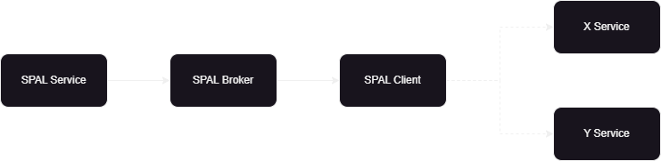

# TheStandard.SPAL.POC
Proof of concept to implement SPAL concept under The Standard paradigm.

SPAL comes from Standard Provider Abstraction Library.
The main idea underneath this concept is being able to have multiple implementations for the same purpose. This approach enable us to use one or another implementation at design time or even at runtime.

<h3>Use case examples at design time</h4>

* Storage brokers. Switch between any data access layer implementation.
* Base components for IU desing. Switch between any presentation layer implementation.

<h3>Use case examples at runtime</h4>

* Storage brokers which interact with multiple external systems. Imagine all the differents implementations for payments platforms like PayPal, Google Pay, Apple Pay, RedSys, CECA and so on. All exist for the same purpose, essentially pay for a purchase